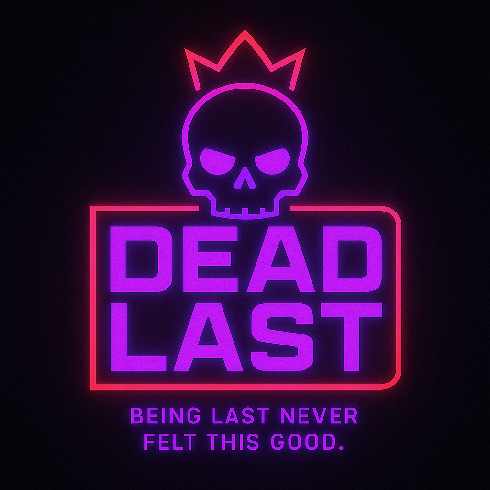
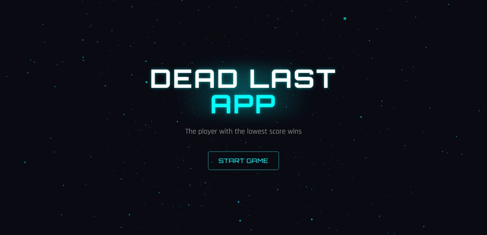
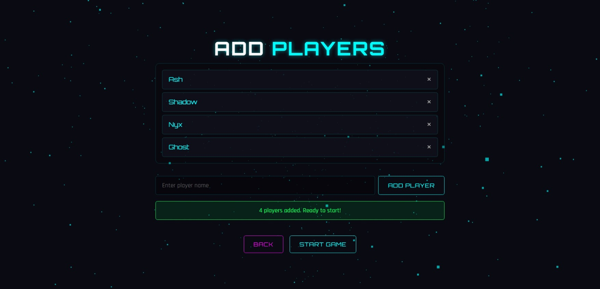

# 🎮 DEAD LAST 🎲

  

> *"Being last never felt this good."* ✨

A cyberpunk-themed card game scoring app where the lowest score wins! Track your games in style with neon aesthetics and smooth animations. 🌟

## 🎯 Quick Links

  

## 🚀 Features
- 🎲 **Real-time Score Tracking** - Dynamic updates with slick animations
- 🔄 **Multi-round System** - Play through 5 intense rounds
- 👥 **Player Management** - Add and manage 2-6 players
- 🎨 **Interactive 3D UI** - Powered by Three.js
- 💾 **Auto-save** - Never lose your game progress
- 🌙 **Dark Mode** - Easy on the eyes, heavy on style

## 💻 Tech Stack

## 📸 Screenshots

### 🎮 Main Game Interface

### 👥 Player Management

## 🎯 How to Play

1. 🎲 Open `index.html` in your web browser
2. 🚀 Click "Start Game" on the intro screen
3. 👥 Add player names (minimum 4 players)
4. ✍️ Start the game and input scores for each round
5. 🏆 The player with the lowest total score wins!

## 🎨 Customization

Feel free to customize the application by modifying:

- 🎨 Color scheme in the CSS variables (`:root` section in `styles.css`)
- 🌟 3D background effects in the `initBackgroundEffects` function
- ✨ Animation parameters in the GSAP animations
- 🔄 Page transitions in the `navigateToPage` function
- 💬 Winner celebration quotes in the `celebrationQuotes` array
- 🔢 Number of rounds by changing the `TOTAL_ROUNDS` constant
- 👥 Player count limits by adjusting `MIN_PLAYERS` and `MAX_PLAYERS` constants

## 💖 Credits

Created with ♦️ for card game enthusiasts everywhere 